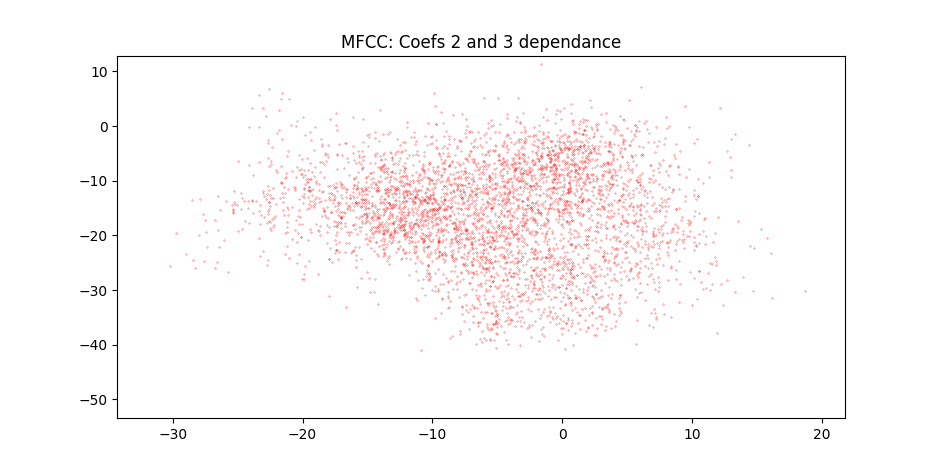

PAV - P4: reconocimiento y verificación del locutor
===================================================

Obtenga su copia del repositorio de la práctica accediendo a [Práctica 4](https://github.com/albino-pav/P4)
y pulsando sobre el botón `Fork` situado en la esquina superior derecha. A continuación, siga las
instrucciones de la [Práctica 2](https://github.com/albino-pav/P2) para crear una rama con el apellido de
los integrantes del grupo de prácticas, dar de alta al resto de integrantes como colaboradores del proyecto
y crear la copias locales del repositorio.

También debe descomprimir, en el directorio `PAV/P4`, el fichero [db_8mu.tgz](https://atenea.upc.edu/mod/resource/view.php?id=3508877?forcedownload=1)
con la base de datos oral que se utilizará en la parte experimental de la práctica.

Como entrega deberá realizar un *pull request* con el contenido de su copia del repositorio. Recuerde
que los ficheros entregados deberán estar en condiciones de ser ejecutados con sólo ejecutar:

~~~~~~~~~~~~~~~~~~~~~~~~~~~~~~~~~~~~~~~~~~~~~~~~~~~~~.sh
  make release
  run_spkid mfcc train test classerr verify verifyerr
~~~~~~~~~~~~~~~~~~~~~~~~~~~~~~~~~~~~~~~~~~~~~~~~~~~~~

Recuerde que, además de los trabajos indicados en esta parte básica, también deberá realizar un proyecto
de ampliación, del cual deberá subir una memoria explicativa a Atenea y los ficheros correspondientes al
repositorio de la práctica.

A modo de memoria de la parte básica, complete, en este mismo documento y usando el formato *markdown*, los
ejercicios indicados.

## Ejercicios.

### SPTK, Sox y los scripts de extracción de características.

- Analice el script `wav2lp.sh` y explique la misión de los distintos comandos involucrados en el *pipeline*
  principal (`sox`, `$X2X`, `$FRAME`, `$WINDOW` y `$LPC`). Explique el significado de cada una de las 
  opciones empleadas y de sus valores.
    + **sox:** Transforma el fichero WAV en un stream de int16.
    + **x2x:** Pasa de int16 a float32
    + **frame:** Extrae frames del stream de float32, con los parametros `-l` i
        `-p` se decide la longitud de la ventana y el desplazamiento,
        respectivamente.
    + **window:** Aplica un enventanado a los frames extraidos anteriormente.
    + **lpc:** Calcula los `-m` coeficientes LPC de cada frame.

- Explique el procedimiento seguido para obtener un fichero de formato *fmatrix* a partir de los ficheros de
  salida de SPTK (líneas 45 a 47 del script `wav2lp.sh`).

  Solo se necesita saber el numero de filas i columnas para poner el header al
  fichero fmatrix. Para ello se calculan en base al numero de coeficientes y la
  longitud del fichero. Una vez se tienen se deben pasar de ascii a uint32 y
  poner como cabecera del fichero.

  + ¿Por qué es conveniente usar este formato (u otro parecido)? Tenga en cuenta cuál es el formato de
    entrada y cuál es el de resultado.

    De esta manera los datos ya estan guardados como float32 y no como ascii, esto hace que no se tengan
    que convertir cada vez que se vaya a leer el fichero. Ademas una vez obtenidos las características
    de SPTK los cambios que se tienen que hacer a los datos són mínimos (solo añadir una cabecera),
    cosa que hace el programa mas eficiente.

- Escriba el *pipeline* principal usado para calcular los coeficientes cepstrales de predicción lineal
  (LPCC) en su fichero <code>scripts/wav2lpcc.sh</code>:

 ```bash
sox $inputfile -t raw -e signed -b 16 - |
    $X2X +sf |
    $FRAME -l 240 -p 80 |
    $WINDOW -l 240 -L 240 |
	$LPC -l 240 -m $lpc_order |
    $LPCC -m $lpc_order -M $lpcc_order > $base.lpcc
 ```

- Escriba el *pipeline* principal usado para calcular los coeficientes cepstrales en escala Mel (MFCC) en su
  fichero <code>scripts/wav2mfcc.sh</code>:

```bash
sox $inputfile -t raw -e signed -b 16 - |
    $X2X +sf |
    $FRAME -l 240 -p 80 |
    $WINDOW -l 240 -L 240 |
	$MFCC -w 1 -s 8 -l 240 -m $mfcc_order -n $mfcc_banks > $base.mfcc
```

### Extracción de características.

- Inserte una imagen mostrando la dependencia entre los coeficientes 2 y 3 de las tres parametrizaciones
  para todas las señales de un locutor.

  En el eje X se encuentra el coeficiente 2 y en el eje Y el coeficiente 3.
  
  LP

  

  LPCC
  
  

  MFCC
  
  


  + Indique **todas** las órdenes necesarias para obtener las gráficas a partir de las
    señales parametrizadas.
  
    Hemos modificado el fichero [plot_gmm_feat.py](scripts/plot_gmm_feat.py) para que
    no haga el plot de los contornos y cambie el título, el resultado se encuentra en
    [plot_coefs.py](scripts/plot_coefs.py). A partir de ahí hemos indicado los
    coeficientes a usar con los argumentos `xDim` i `yDim`, y dando los ficheros .FEAT
    correspondientes.
    ```bash
    scripts/plot_coefs.py -x 2 -y 3 work/gmm/lp/SES000.gmm work/lp/BLOCK00/SES000/*
    scripts/plot_coefs.py -x 2 -y 3 work/gmm/lpcc/SES000.gmm work/lpcc/BLOCK00/SES000/*
    scripts/plot_coefs.py -x 2 -y 3 work/gmm/mfcc/SES000.gmm work/mfcc/BLOCK00/SES000/*
    ```

  + ¿Cuál de ellas le parece que contiene más información?
    En este caso parece qu MFCC tiene más información ya que los datos estan mas dispersos,
    seguida de cerca por LPCC. LP es el que contiene menos información ya que es el que tiene
    mas dependencia, se puede ver como la gráfica parece una recta.

- Usando el programa <code>pearson</code>, obtenga los coeficientes de correlación normalizada entre los
  parámetros 2 y 3 para un locutor, y rellene la tabla siguiente con los valores obtenidos.

  |                        | LP   | LPCC | MFCC |
  |------------------------|:----:|:----:|:----:|
  | &rho;<sub>x</sub>[2,3] |      |      |      |
  
  + Compare los resultados de <code>pearson</code> con los obtenidos gráficamente.
  
- Según la teoría, ¿qué parámetros considera adecuados para el cálculo de los coeficientes LPCC y MFCC?

### Entrenamiento y visualización de los GMM.

Complete el código necesario para entrenar modelos GMM.

- Inserte una gráfica que muestre la función de densidad de probabilidad modelada por el GMM de un locutor
  para sus dos primeros coeficientes de MFCC.
  
- Inserte una gráfica que permita comparar los modelos y poblaciones de dos locutores distintos (la gŕafica
  de la página 20 del enunciado puede servirle de referencia del resultado deseado). Analice la capacidad
  del modelado GMM para diferenciar las señales de uno y otro.

### Reconocimiento del locutor.

Complete el código necesario para realizar reconociminto del locutor y optimice sus parámetros.

- Inserte una tabla con la tasa de error obtenida en el reconocimiento de los locutores de la base de datos
  SPEECON usando su mejor sistema de reconocimiento para los parámetros LP, LPCC y MFCC.
 
|       | LP   | LPCC | MFCC |
|-------|:----:|:----:|:----:|
| Error |      |      |      |

### Verificación del locutor.

Complete el código necesario para realizar verificación del locutor y optimice sus parámetros.

- Inserte una tabla con el *score* obtenido con su mejor sistema de verificación del locutor en la tarea
  de verificación de SPEECON. La tabla debe incluir el umbral óptimo, el número de falsas alarmas y de
  pérdidas, y el score obtenido usando la parametrización que mejor resultado le hubiera dado en la tarea
  de reconocimiento.
 
  |       | LP   | LPCC | MFCC |
  |-------|:----:|:----:|:----:|
  | score |      |      |      |

### Test final

- Adjunte, en el repositorio de la práctica, los ficheros `class_test.log` y `verif_test.log` 
  correspondientes a la evaluación *ciega* final.

### Trabajo de ampliación.

- Recuerde enviar a Atenea un fichero en formato zip o tgz con la memoria (en formato PDF) con el trabajo 
  realizado como ampliación, así como los ficheros `class_ampl.log` y/o `verif_ampl.log`, obtenidos como 
  resultado del mismo.
